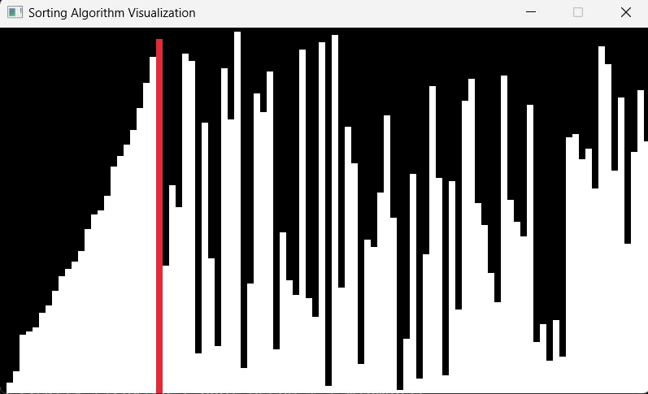
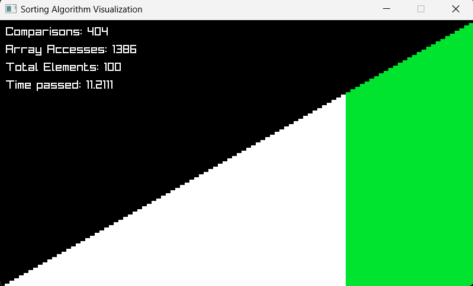

In my local I have used vcpkg for installing the raylib and Visual studio 2022 for editing

*Bubble Sort
*Merge Sort
*Quick Sort

You can adjust the comments for selecting the algorithm(lines are 268, 269, 270)

Build scripts will be included later

